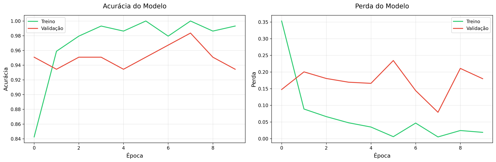
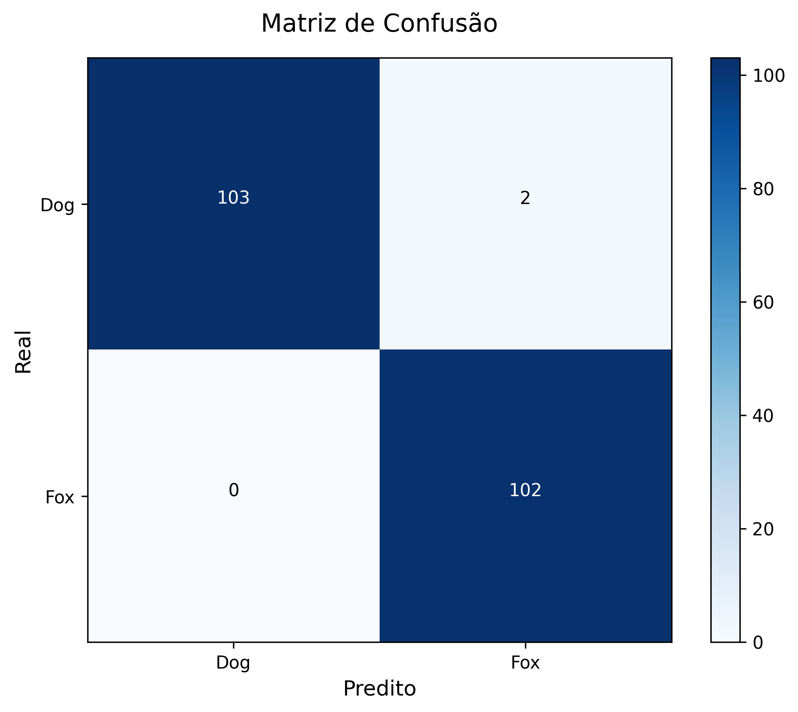
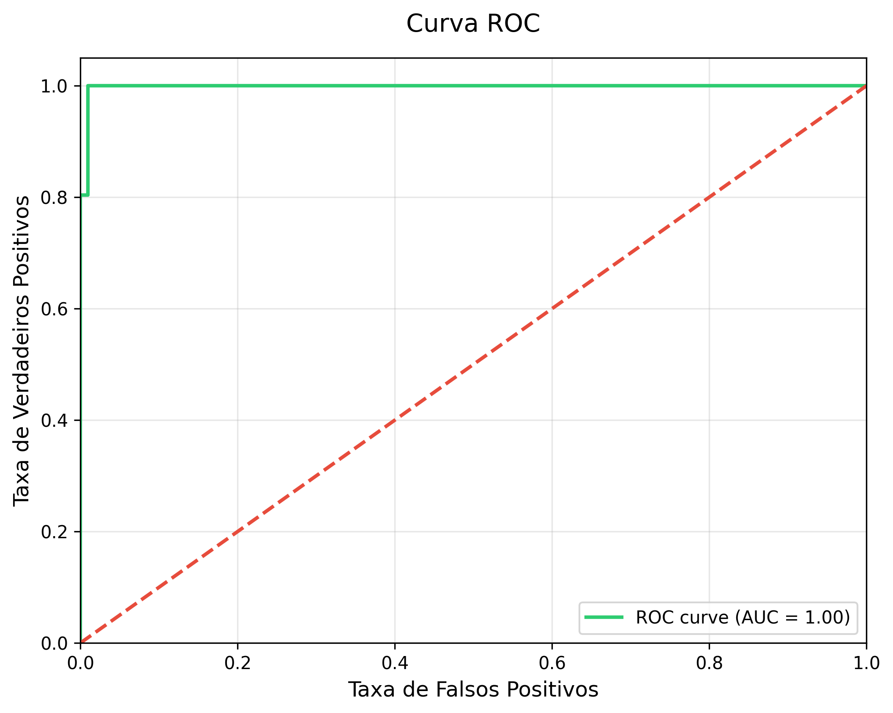
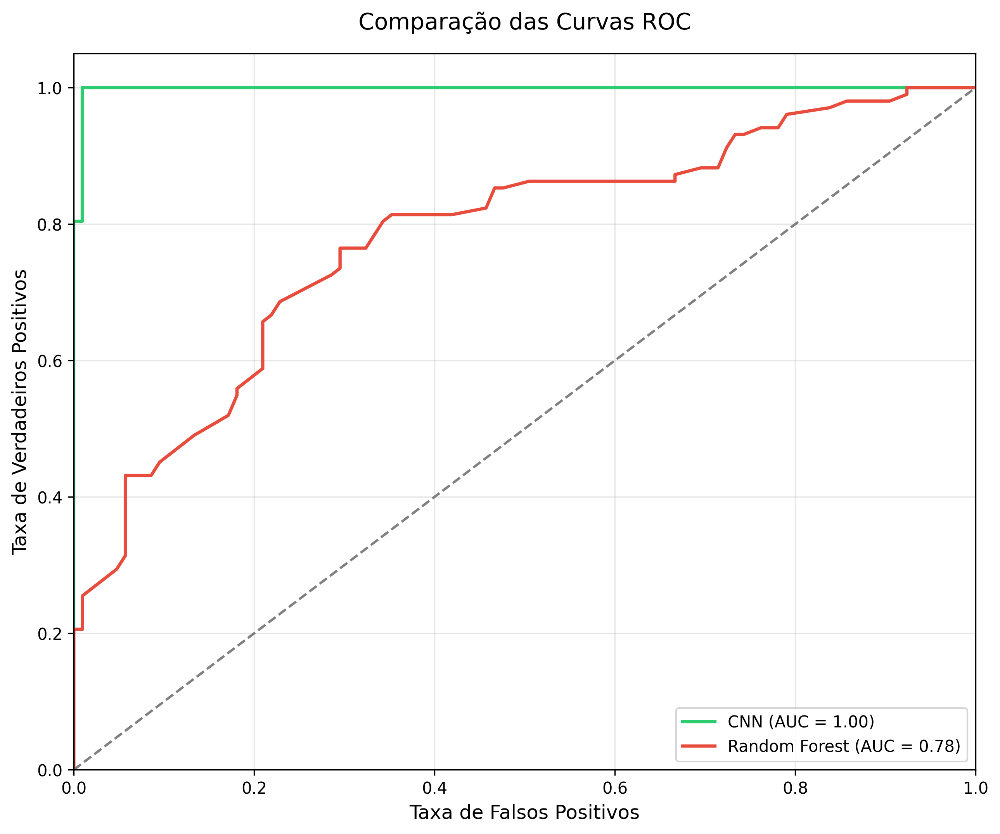

# Classificador de Imagens com Transfer Learning

Este projeto implementa um classificador de imagens usando Transfer Learning para distinguir entre fotos de cachorros e raposas. O modelo é baseado na arquitetura MobileNetV2 pré-treinada e foi desenvolvido como parte do desafio de Transfer Learning em Deep Learning.

## 📋 Índice
- [Sobre o Projeto](#-sobre-o-projeto)
- [Estrutura do Projeto](#-estrutura-do-projeto)
- [Requisitos](#-requisitos)
- [Conjunto de Dados](#-conjunto-de-dados)
- [Metodologia](#-metodologia)
- [Resultados](#-resultados)
- [Como Usar](#-como-usar)

## 🎯 Sobre o Projeto
O objetivo principal deste projeto é aplicar técnicas de Transfer Learning em uma rede neural profunda para criar um classificador de imagens eficiente. O projeto utiliza a arquitetura MobileNetV2 pré-treinada como base e a adapta para a tarefa específica de classificação binária entre cachorros e raposas.

## 📁 Estrutura do Projeto
```
├── dataset/
│   ├── dog/           # Imagens de cachorros para treino
│   ├── fox/           # Imagens de raposas para treino
├── predict/       # Imagens para predição
├── models/            # Modelos salvos
├── results/          # Gráficos e resultados
└── Dio-Transfer-Learning.ipynb
```

## 📦 Requisitos
- Python 3.x
- TensorFlow 2.x
- Scikit-learn
- NumPy
- Pandas
- Matplotlib
- PIL (Python Imaging Library)

## 📊 Conjunto de Dados
O dataset é composto por:
- 105 imagens de cachorros
- 102 imagens de raposas
- Divisão do dataset:
  - 70% para treino
  - 15% para validação
  - 15% para teste

## 🔧 Metodologia

### 1. Preparação dos Dados
- Redimensionamento das imagens para 224x224 pixels
- Normalização dos valores dos pixels (divisão por 255)
- Aumento de dados (data augmentation) com:
  - Rotação
  - Deslocamento horizontal e vertical
  - Espelhamento horizontal

### 2. Arquitetura do Modelo
- Base: MobileNetV2 pré-treinada na ImageNet
- Camadas adicionadas:
  - GlobalAveragePooling2D
  - Dense (128 neurônios, ReLU)
  - Dropout (0.2)
  - Dense (1 neurônio, Sigmoid)

### 3. Treinamento
- Otimizador: Adam
- Função de perda: Binary Crossentropy
- Métrica: Accuracy
- Número de épocas: 10
- Batch size: 32

### 4. Avaliação
O modelo é avaliado usando:
- Matriz de confusão
- Curva ROC e AUC
- Relatório de classificação com precisão, recall e F1-score

## 📈 Resultados
O modelo gera diversos gráficos e métricas:
- Histórico de treinamento (acurácia e perda)
- Matriz de confusão
- Curva ROC
- Métricas detalhadas de classificação

## 🚀 Como Usar

### Treinar o Modelo
```python
# Executar o treinamento com os splits padrão
main(train_split=0.8, val_split=0.1, test_split=0.1)
```

### Fazer Predições
```python
# Usar o notebook Dio-Transfer-Learning-Predict.ipynb
# Carregar uma imagem e fazer uma predição
image_path = 'caminho/para/imagem.jpg'
predicted_class, confidence = predict_image(image_path)
```

## 🛠️ Funções Principais

### `prepare_data()`
- Prepara os dados para treinamento, validação e teste
- Implementa data augmentation
- Configura os geradores de dados

### `create_model()`
- Cria o modelo usando Transfer Learning
- Carrega a MobileNetV2 pré-treinada
- Adiciona camadas personalizadas

### `train_model()`
- Compila e treina o modelo
- Configura otimizador e função de perda
- Monitora métricas durante o treinamento

### `evaluate_model()`
- Avalia o desempenho do modelo
- Calcula métricas de avaliação
- Gera visualizações dos resultados

### `predict_image()`
- Carrega e pré-processa uma única imagem
- Faz predição usando o modelo treinado
- Retorna a classe predita e a confiança

## 📊 Visualizações
O projeto gera várias visualizações:
- Gráficos de acurácia e perda durante o treinamento: 
- Matriz de confusão: 
- Curva ROC: 
- Comparação entre modelos (CNN vs Random Forest): 

## ✨ Principais Características
- Implementação de Transfer Learning
- Data Augmentation para melhor generalização
- Avaliação completa do modelo
- Visualizações detalhadas dos resultados
- Interface simples para predições

## 🔗 Referências
- [TensorFlow Documentation](https://www.tensorflow.org/)
- [MobileNetV2 Paper](https://arxiv.org/abs/1801.04381)
- [Transfer Learning Guide](https://www.tensorflow.org/tutorials/images/transfer_learning)